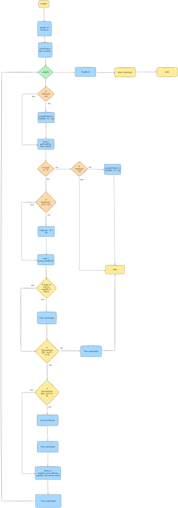

# holbertonschool-simple_shell

A simple UNIX command line interpreter written in C, developed as part of the Holberton School curriculum.



## Description

**Simple Shell** is a minimalist UNIX shell that replicates a small subset of the behavior of standard shells such as `sh`.

The shell reads user input from standard input, parses commands and arguments, searches for executable files in the `PATH`, and executes them using low-level system calls.

It supports both **interactive** and **non-interactive** modes.

## Objectives

The main objectives of this project are:

- Understand how a UNIX shell works internally
- Learn to use system calls such as `fork`, `execve`, and `wait`
- Handle user input and command parsing
- Work with environment variables
- Implement basic built-in commands
- Respect Holberton School coding standards
- Write clean, modular, and maintainable C code

## Requirements

### Compilation

The project must be compiled with:

```bash
gcc -Wall -Werror -Wextra -pedantic -std=gnu89
```

### Betty Coding Style

All code strictly follows the **Betty coding style**, including:

- Proper formatting
- Clear documentation
- Clean file and function organization

### Project Constraints

- No global variables
- Maximum of 5 functions per file
- All header files include include guards
- Only allowed C standard library functions and system calls are used
- No memory leaks allowed

## Prototype

```c
int main(void);
```

## Features

The shell supports the following features:

- Execution of commands with arguments
- PATH resolution for executables
- Interactive mode with prompt
- Non-interactive mode (input via pipe or file)
- Built-in commands:
  - `exit` — exits the shell
  - `env` — prints the current environment

## Example Usage

### Interactive Mode

```bash
$ ./hsh
($) ls
file1.c  file2.c
($) env
PATH=/usr/bin:/bin
($) exit
```

### Non-Interactive Mode

```bash
$ echo "ls -l" | ./hsh
```

## Man Page

A manual page (`man_1_simple_shell`) is included to document the usage and behavior of the shell.

To view the man page:

```bash
man ./man_1_simple_shell
```

## Betty and Valgrind

### Install Betty 

#### Clone Betty repo
```bash
git clone https://github.com/hs-hq/Betty.git
```
#### Create Betty file and add script

```bash
vi betty
```

```bash
#!/bin/bash
BIN_PATH="/usr/local/bin"
BETTY_STYLE="betty-style"
BETTY_DOC="betty-doc"

if [ "$#" = "0" ]; then
    echo "No arguments passed."
    exit 1
fi

for argument in "$@"; do
    echo -e "\n========== $argument =========="
    ${BIN_PATH}/${BETTY_STYLE} "$argument"
    ${BIN_PATH}/${BETTY_DOC} "$argument"
done
```

#### Add permission on file and move the file

```bash
chmod a+x betty
```

```bash
sudo mv betty /bin/
```

### Betty Check

```bash
betty *.c *.h
```

### Install Valgrind

```bash
sudo apt install valgrind
```

### Valgrind Check

```bash
valgrind --leak-check=full ./hsh
```

## Compilation

```bash
gcc -Wall -Werror -Wextra -pedantic -std=gnu89 *.c -o hsh
```

## Project Structure

- `simple_shell.c` - Contain main program
- `functions_env.c` - Function env for main
- `functions.c` - Functions for main
- `simple_shell.h` - Header file with prototypes and macros
- `man_1_simple_shell` — Manual page
- `AUTHORS` — List of contributors

## Limitations

This shell does **not** support:

- Pipes (`|`)
- Redirections (`>`, `<`, `>>`)
- Logical operators (`&&`, `||`)
- Wildcards or globbing
- Advanced quoting or escaping

## Authors

- [Blee Leny](https://github.com/LenyBl)
- [Kedia Ihogoza](https://github.com/Kedia12)

## License

This project may be freely used and modified for educational purposes.
